# End-to-End Data Engineering Pipeline: Retail Customer Analytics

A comprehensive data engineering project demonstrating the complete data lifecycle from raw data ingestion to machine learning application deployment. This project implements customer segmentation using RFM analysis and K-means clustering for retail transaction data.

**By Jonathan Musni** | 💼 [LinkedIn](https://www.linkedin.com/in/musni-jonathan) | 🐙 [GitHub](https://github.com/jemusni07) | 📧 musni.jonathan7@gmail.com

## Project Overview

This data engineering project showcases a full-stack implementation covering:

- **Data Ingestion Layer**: Automated daily batch processing from S3
- **Data Processing Layer**: Multi-layered ETL pipeline using Delta Live Tables  
- **Data Storage Layer**: Delta Lake with medallion architecture (Bronze/Silver/Gold)
- **Analytics Layer**: RFM customer segmentation and behavioral analysis
- **Application Layer**: Machine learning clustering with materialized results
- **Monitoring Layer**: Comprehensive data quality and pipeline observability

## Data Source

- **Dataset**: [Online Retail II - UCI ML Repository](https://archive.ics.uci.edu/dataset/502/online+retail+ii)
- **Description**: UK-based online retail transactions (2009-2011) for unique gift-ware
- **Customer Base**: Primarily wholesalers
- **Transformation**: Historical data split into daily files with shifted dates (2025-2026)

## Data Ingestion Strategy

- **Approach**: Daily batch processing simulating real-time operations
- **Date Range**: June 26, 2025 → April 24, 2026
- **Automation**: [GitHub Actions for scheduled S3 uploads](https://github.com/jemusni07/daily_uploads)
- **Storage**: AWS S3 bucket (`s3://raw-retail-jmusni/daily_sales/`)

## Data Architecture

```mermaid
graph TD
    subgraph "Data Preparation"
        UCI[UCI Repository<br/>Historical CSV Dataset<br/>2009-2011]
        SPLIT[Manual Process<br/>Data Splitting<br/>Date Shifting to 2025-2026]
    end
    
    subgraph "Source Control"
        GITHUB[GitHub Repo<br/>Daily CSV Split Files]
    end
    
    subgraph "Automation"
        ACTIONS[GitHub Actions<br/>CRON Trigger<br/>Daily Upload]
        S3[AWS S3 Bucket<br/>/daily_sales/<br/>CSV Files]
    end
    
    subgraph "Ingestion Pipeline"
        DLT[Delta Live Tables<br/>Daily Triggered<br/>CloudFiles Streaming]
    end
    
    subgraph "Medallion Architecture"
        BRONZE[🥉 Bronze Layer<br/>Raw Ingestion + Metadata]
        SILVER[🥈 Silver Layer<br/>Cleaned & Validated Data]
        GOLD[🥇 Gold Layer<br/>RFM Aggregated Metrics]
    end
    
    subgraph "Application Layer"
        ML[ML Pipeline<br/>K-means Clustering]
        SEGMENTS[Customer Segments<br/>Materialized Table]
        DASHBOARD[RFM Analytics Dashboard<br/>rfm-dashboard-q7ne.onrender.com]
    end
    
    subgraph "Monitoring & Quality"
        DQ[Data Quality<br/>Expectations]
        MONITOR[Pipeline Monitoring]
        LINEAGE[Data Lineage Tracking]
    end
    
    UCI --> SPLIT
    SPLIT --> GITHUB
    GITHUB --> ACTIONS
    ACTIONS --> S3
    S3 --> DLT
    DLT --> BRONZE
    BRONZE --> SILVER
    SILVER --> GOLD
    GOLD --> ML
    ML --> SEGMENTS
    SEGMENTS --> DASHBOARD
    
    BRONZE --> DQ
    SILVER --> DQ
    GOLD --> DQ
    DLT --> MONITOR
    DLT --> LINEAGE
    
    style UCI fill:#e1f5fe
    style SEGMENTS fill:#f3e5f5
    style DASHBOARD fill:#e8f5e8
    style BRONZE fill:#ffd54f
    style SILVER fill:#e0e0e0
    style GOLD fill:#ffd700
```


</details>

## Pipeline Layers

### 🥉 Bronze Layer - Raw Data Ingestion
- **File**: `dlt_scripts/01_bronze_layer.py`
- **Purpose**: Raw data landing zone with full fidelity
- **Features**: CloudFiles streaming, metadata capture, basic filtering
- **Schema**: Original CSV structure + pipeline metadata

### 🥈 Silver Layer - Cleaned & Validated Data  
- **File**: `dlt_scripts/02_silver_layer.py`
- **Purpose**: Clean, validated, and enriched data for analytics
- **Features**: Data quality expectations, type casting, feature engineering
- **Transformations**: Cancellation flags, total price calculations, date parsing

### 🥇 Gold Layer - Business-Ready Analytics
- **File**: `dlt_scripts/05_customer_rfm_gold.sql`
- **Purpose**: Aggregated metrics for business intelligence
- **Features**: RFM calculation, customer-level aggregations
- **Output**: Customer behavioral metrics ready for ML

### 🧠 Application Layer - Machine Learning
- **File**: `customer_segmentation_kmeans_clustering/RFM data clustering.ipynb`
- **Purpose**: Customer segmentation using unsupervised learning
- **Features**: K-means clustering, segment analysis, model persistence
- **Output**: Materialized customer segments for business applications

## Customer Segmentation Strategy

### Intelligent Clustering Approach
- **Automated K-Selection**: Combined silhouette score (60%) + elbow method (40%) for optimal clusters
- **Outlier Management**: Separates outliers before clustering to improve model accuracy
- **Data Preprocessing**: StandardScaler normalization of RFM metrics for fair clustering
- **3D Analysis**: Clusters based on scaled Recency, Frequency, and Monetary dimensions

#### Outlier Detection Methodology
The clustering algorithm uses **IQR-based outlier detection** to identify and handle extreme customers before applying K-means:

**Statistical Outlier Identification:**
```python
# Monetary Value Outliers
M_Q1 = df["Monetary"].quantile(0.25)
M_Q3 = df["Monetary"].quantile(0.75)
M_IQR = M_Q3 - M_Q1
monetary_outliers = df[(df["Monetary"] > (M_Q3 + 1.5 * M_IQR)) | 
                      (df["Monetary"] < (M_Q1 - 1.5 * M_IQR))]

# Frequency Outliers  
F_Q1 = df['Frequency'].quantile(0.25)
F_Q3 = df['Frequency'].quantile(0.75) 
F_IQR = F_Q3 - F_Q1
frequency_outliers = df[(df['Frequency'] > (F_Q3 + 1.5 * F_IQR)) | 
                       (df['Frequency'] < (F_Q1 - 1.5 * F_IQR))]
```

**Outlier Cluster Assignment:**
- **Cluster -1**: Monetary-only outliers (extremely high/low spending customers)
- **Cluster -2**: Frequency-only outliers (extremely frequent/rare purchasing customers)  
- **Cluster -3**: Combined outliers (extreme in both monetary and frequency dimensions)

**Business Rationale:**
K-means clustering is sensitive to outliers because it uses squared Euclidean distance, causing extreme values to disproportionately influence cluster centroids. By pre-identifying and separately categorizing outliers:
- Main customer segments reflect typical behavioral patterns
- Extreme customers receive specialized business treatment
- Clustering accuracy improves for the majority population
- Outlier customers are preserved for targeted VIP/risk management strategies

### Business-Friendly Segment Classifications

#### 🏆 **Premium Tiers**
- **Super VIP Champions**: Ultra-high value + high frequency + recent activity
- **VIP At Risk**: Ultra-high value + high frequency + dormant customers  
- **Ultra High Value Active**: Extremely high spenders with active engagement

#### 💎 **High-Value Tiers**
- **Champions**: High monetary & frequency with recent activity
- **Big Spenders**: High monetary value with lower frequency
- **Loyal Customers At Risk**: Previously loyal customers becoming dormant

#### ⚡ **Active Engagement Tiers**
- **Super Frequent Active**: Very frequent buyers with moderate spending
- **Potential Loyalists**: Customers showing growth potential
- **Frequent Buyers**: Regular purchasers with consistent activity

#### ⚠️ **Risk Management Tiers**
- **Cannot Lose Them**: Frequent buyers who have gone dormant
- **At Risk Customers**: Various risk levels across value tiers
- **High Value At Risk**: Valuable customers showing dormancy signs

#### 📈 **Growth & New Segments**
- **New Customers**: Recent acquisitions with low initial activity
- **Hibernating**: Low-value, low-frequency, dormant customers

### RFM Metrics & Business Logic

#### **Smart Thresholds**
- **Monetary Tiers**: High (>median), Ultra-high (>2x median), Super-high (>4x median)
- **Recency Scoring**: Recent vs. Dormant based on median days since purchase
- **Frequency Analysis**: From single purchase to super frequent buyers

#### **Actionable Business Recommendations**
Each segment receives tailored strategies:
- **VIP Segments**: White-glove service, personal account managers, exclusive previews
- **High-Value Segments**: Premium recommendations, loyalty rewards, cross-sell opportunities  
- **At-Risk Segments**: Win-back campaigns, personalized offers, reactivation incentives
- **Growth Segments**: Upselling campaigns, subscription models, frequency building
- **New/Low-Value**: Educational content, onboarding programs, trial offers

### Cluster-to-Segment Mapping Logic

#### **Centroid-Based Classification**
The system maps K-means cluster numbers to business segments using **cluster centroids** (median RFM values per cluster) rather than individual customer values:

```python
# Foundation variables for each cluster
overall_monetary = median(all_customer_monetary_values)
overall_frequency = median(all_customer_frequency_values) 
overall_recency = median(all_customer_recency_values)

# For each cluster, create categorical classifications
monetary_level = 'High' if cluster_median_monetary > overall_monetary else 'Low'
frequency_level = 'High' if cluster_median_frequency > overall_frequency else 'Low'
recency_level = 'Recent' if cluster_median_recency < overall_recency else 'Dormant'
```

#### **Hierarchical Decision Tree**
Segment assignment follows a **tiered conditional logic** with specific multiplier thresholds:

**Tier 1: Super VIP (>2x monetary + >2x frequency)**
```sql
WHEN Med_Monetary > overall_monetary * 2 AND Med_Frequency > overall_frequency * 2
  AND recency_level = 'Recent' THEN 'Super VIP Champions'
  AND recency_level = 'Dormant' THEN 'VIP At Risk'
```

**Tier 2: Ultra High Value (>4x monetary)**
```sql
WHEN Med_Monetary > overall_monetary * 4 
  AND Med_Frequency > overall_frequency AND recency_level = 'Recent' 
  THEN 'Ultra High Value Active'
```

**Tier 3: High Value (2x-4x monetary)**
```sql
WHEN Med_Monetary > overall_monetary * 2 AND Med_Monetary <= overall_monetary * 4
  AND Med_Frequency > overall_frequency AND recency_level = 'Recent'
  THEN 'High Value Active'
```

**Tier 4: Champions (1x-2x monetary + 1x-2x frequency)**
```sql
WHEN Med_Monetary > overall_monetary AND Med_Monetary <= overall_monetary * 2
  AND Med_Frequency > overall_frequency AND recency_level = 'Recent'
  THEN 'Champions'
```

#### **Key Mapping Features**
- **Statistical Thresholds**: Uses 2x, 4x multipliers for monetary; 2x for frequency
- **Order Dependency**: Most specific conditions evaluated first (VIP → High Value → Regular)
- **Cluster-Specific Rules**: Special handling for outlier clusters (-1, -2, -3)
- **Hybrid Logic**: Combines statistical analysis with business intuition
- **Comprehensive Coverage**: 15+ distinct segment types covering all RFM combinations

#### **Example Cluster Transformation**
```python
# Cluster 0: Med_Monetary=1500, Med_Frequency=8, Med_Recency=45
# Overall: Monetary=800, Frequency=4, Recency=60

if 1500 > 800*2 and 8 > 4*2 and 45 < 60:
    segment = "Super VIP Champions"  # High monetary, high frequency, recent
```

### Production Implementation
- **Materialized Delta Tables**: `customer_rfm_kmeans_clustered`, `cluster_summary`, `cluster_description_and_recommendation`
- **Daily Updates**: Automated refresh with `UpdateDate` tracking
- **3D Visualization**: Interactive cluster analysis and validation
- **Statistical Validation**: Silhouette scores and elbow method for model quality

## Data Contract

### Bronze Layer Schema
```sql
-- retail_transactions_bronze
Invoice: STRING          -- Invoice number
StockCode: STRING        -- Product code
Description: STRING      -- Product description  
Quantity: INTEGER        -- Quantity purchased
Price: DECIMAL(10,2)     -- Unit price
CustomerID: STRING       -- Customer identifier
Country: STRING          -- Customer country
InvoiceDate: STRING      -- Transaction date (raw)
ingestion_timestamp: TIMESTAMP -- Pipeline processing time
source_file: STRING      -- Source file path
processing_date: DATE    -- Processing date
```

### Silver Layer Schema
```sql
-- retail_transactions_silver
InvoiceNo: STRING        -- Cleaned invoice number (not null, length 6-7)
StockCode: STRING        -- Product code (not null)
Description: STRING      -- Product description (nulls allowed)
Quantity: INTEGER        -- Quantity (not null, >0)
UnitPrice: DECIMAL(10,2) -- Unit price (>=0, nulls allowed)
CustomerID: STRING       -- Customer ID (nulls allowed)
Country: STRING          -- Customer country
InvoiceDate: DATE        -- Parsed date (not null)
IsCancellation: BOOLEAN  -- Cancellation flag
TotalPrice: DECIMAL(12,2) -- Calculated total (Quantity × UnitPrice)
Year: INTEGER            -- Extracted year
Month: INTEGER           -- Extracted month
DayOfWeek: INTEGER       -- Extracted day of week (1-7)
SurrogateKey: STRING     -- Unique identifier (InvoiceNo_StockCode_Quantity)
ingestion_timestamp: TIMESTAMP -- From Bronze layer
source_file: STRING      -- From Bronze layer
processing_date: DATE    -- From Bronze layer
```

### Gold Layer Schema
```sql
-- customer_rfm_gold
CustomerID: STRING       -- Customer identifier
MaxInvoiceDate: DATE     -- Last purchase date
Recency: INTEGER         -- Days since last purchase
Frequency: INTEGER       -- Number of transactions
Monetary: DECIMAL        -- Total spend amount
```

## Data Quality & Monitoring

### Quality Expectations (Silver Layer)
- **valid_invoice_no**: Invoice length 6-7 characters, not null
- **valid_stock_code**: Stock code must be present
- **valid_quantity**: Quantity > 0 and not null
- **valid_unit_price**: Unit price >= 0
- **valid_invoice_date**: Valid date format required

### Quality Monitoring Scripts
- **Bronze DQ**: `dlt_scripts/01_bronze_dq.sql` - Data quality tracking at ingestion
- **Daily Counts**: `dlt_scripts/04_dlt_daily_counts.sql` - Daily processing metrics
- **Bronze-Silver Comparison**: `dlt_scripts/02_bronze_silver_dq_comparison.sql` - Data validation between layers

### Data Filters & Validation
- Excludes cancellation transactions (Invoice starting with 'C')
- Stock code pattern validation (5-digit codes or 'PADS')
- Customer ID must be present for RFM analysis
- Removes invalid or negative quantities/prices

## Technology Stack

- **Data Platform**: Databricks
- **Orchestration**: Databricks Workflows
- **Storage**: AWS S3 (raw files), Delta Lake (processed data)
- **Pipeline Framework**: Delta Live Tables (DLT)
- **Analytics**: Databricks Notebooks & Dashboards
- **Machine Learning**: scikit-learn (K-means clustering)
- **Automation**: GitHub Actions

## Data Lineage

```mermaid
graph LR
    subgraph "Automation"
        GHA[GitHub Actions<br/>Daily Upload<br/>CRON Schedule]
    end
    
    subgraph "Storage"
        S3[AWS S3 Bucket<br/>/daily_sales/<br/>CSV Files]
    end
    
    subgraph "Tables & Views"
        BRONZE[🥉 Bronze Layer<br/>retail_transactions_bronze<br/>Raw data + metadata]
        SILVER[🥈 Silver Layer<br/>retail_transactions_silver<br/>Cleaned & validated data]
        GOLD[🥇 Gold Layer<br/>customer_rfm_gold<br/>RFM aggregated metrics<br/>Materialized View]
        APP[🤖 Application Output<br/>customer_segments_clustered<br/>K-means customer segments<br/>Materialized Table]
    end
    
    subgraph "Data Quality Monitoring"
        DQ1[bronze_dq<br/>Ingestion Metrics]
        DQ2[dlt_daily_counts<br/>Volume Monitoring]
        DQ3[bronze_silver_dq_comparison<br/>Layer Validation]
    end
    
    GHA --> S3
    S3 --> BRONZE
    BRONZE --> SILVER
    SILVER --> GOLD
    GOLD --> APP
    
    BRONZE --> DQ1
    SILVER --> DQ2
    BRONZE --> DQ3
    SILVER --> DQ3
    
    style BRONZE fill:#ffd54f
    style SILVER fill:#e0e0e0
    style GOLD fill:#ffd700
    style APP fill:#f3e5f5
```



## Repository Structure

```
├── README.md                           # Project documentation
├── UPDATES.md                          # Project timeline and updates
├── dlt_scripts/                        # Delta Live Tables pipeline scripts
│   ├── 01_bronze_layer.py             # Raw data ingestion
│   ├── 01_bronze_dq.sql               # Bronze layer data quality
│   ├── 02_silver_layer.py             # Data cleaning and validation
│   ├── 02_bronze_silver_dq_comparison.sql # Layer comparison
│   ├── 03_gold_layer.py               # Business analytics (commented)
│   ├── 04_dlt_daily_counts.sql        # Daily processing metrics
│   └── 05_customer_rfm_gold.sql       # RFM analysis table
├── customer_segmentation_kmeans_clustering/
│   └── RFM data clustering.ipynb       # Customer segmentation notebook
└── images/                             # Pipeline evolution screenshots
    ├── 06_30_2025.png                 # Bronze layer implementation
    ├── 07_01_2025.png                 # Silver layer addition
    └── 07_02_2025.png                 # Gold layer RFM implementation
```

## Key Features

- **Real-time Processing**: Streaming data ingestion with cloudFiles
- **Data Quality**: Comprehensive validation and expectation handling
- **Customer Analytics**: RFM analysis and behavioral segmentation
- **Monitoring**: Multi-layer data quality tracking
- **Scalability**: Delta Lake optimization and auto-compaction
- **Production Ready**: Materialized views and optimized storage

## 🚀 Live Application

**RFM Customer Analytics Dashboard**: [https://rfm-dashboard-q7ne.onrender.com/](https://rfm-dashboard-q7ne.onrender.com/)

This interactive dashboard demonstrates the end-to-end pipeline results, showcasing:
- Customer segmentation analysis from the ML pipeline
- RFM metrics visualization (Recency, Frequency, Monetary)
- Customer cluster distributions and insights
- Real-time analytics powered by the data engineering pipeline

## Disclaimer

This project is inspired by [TrentDoesMath's YouTube tutorial](https://www.youtube.com/watch?v=afPJeQuVeuY&t=2587s). The main enhancement is operationalizing the analysis for production use with continuous data updates and automated clustering pipeline.
